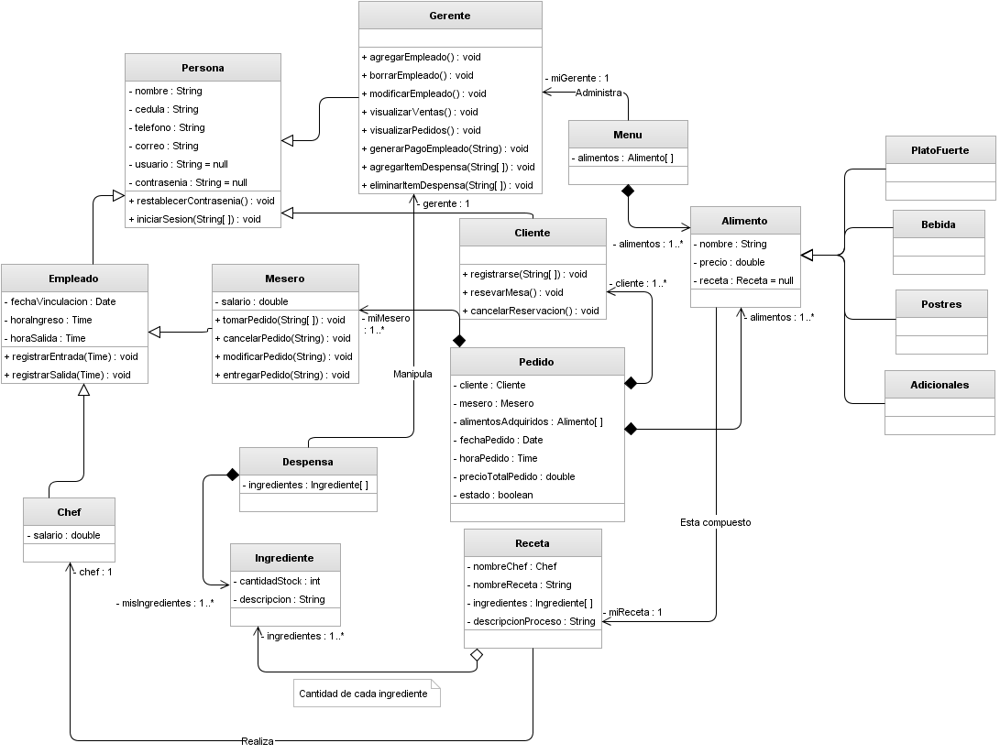

# Sistema de gestión de Restaurante

Proyecto de Java SpringBoot para la materia POO · ITU · UNCUYO

## Tecnologías

- **Backend:** Java 21 · Spring Boot 3.4.5 · Spring Data JPA · Hibernate
- **Frontend:** HTML5 · CSS3 · JavaScript · Bootstrap 5.3
- **Base de datos:** MySQL
- **Herramientas:** IntelliJ IDEA · Maven · XAMPP

## Diagrama UML

## Cómo ejecutar

1. Tener MySQL corriendo en el puerto 3307 (XAMPP)
2. Nombre bbdd: pruebajpa
5. Chequear que las versiones coincidan.
3. Ejecutar el proyecto.
4. Abrir el navegador en `http://localhost:8080`

> La base de datos y los datos iniciales se cargan automáticamente al ejecutar.

## Datos autor

Carla Méndez

Materia: Programación Orientada a Objetos

Instituto Tecnológico Universitario

UNCUYO · 2026
